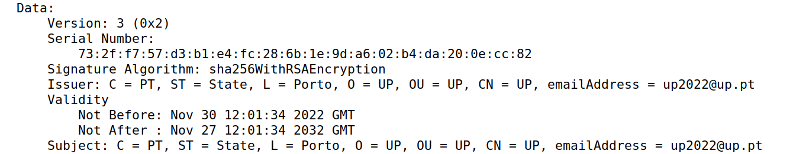
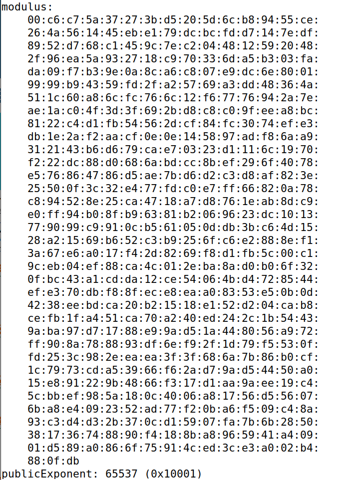
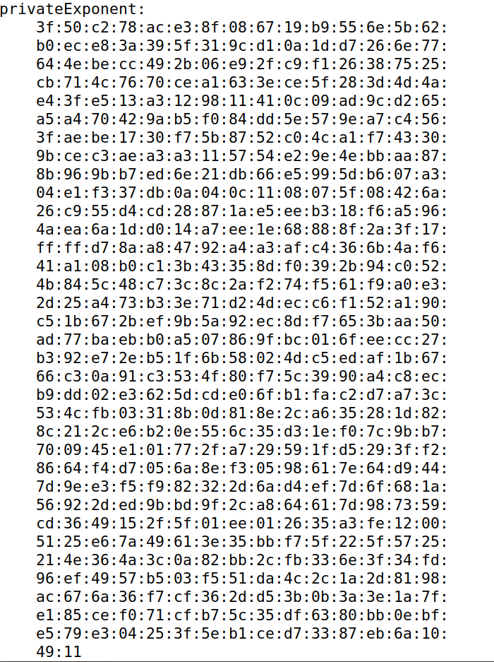
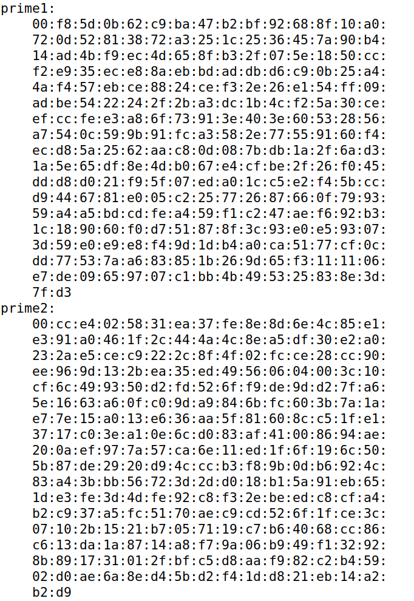
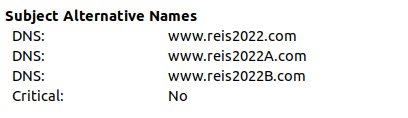

# Week 12

## Task 1: Becoming a Certificate Authority (CA)

- What part of the certificate indicates this is a CA’s certificate?

The Certificate Authority (CA), the one who validates the certificate, can be identified in the issuer of the certificate. 

- What part of the certificate indicates this is a self-signed certificate?

A certificate is self-assigned if both the issuer field and the subject field are the same. This is true for the certificate generated in this task:



- In the RSA algorithm, we have a public exponent e, a private exponent d, a modulus n, and two secret
numbers p and q, such that n = pq.

modulus (n) and public exponent (e):



private exponent (d):



Two secret numbers (p,q -> n=pq)



## Task 2: Generating a Certificate Request for Your Web Server

In this task, we generated a GCR. For that we ran the following command, using our own server name (in this case www.reis2022.com)

```shel
openssl req -newkey rsa:2048 -sha256 \
-keyout server.key -out server.csr \
-subj "/CN=www.reis2022.com/O=Bank32 Inc./C=US" \
-passout pass:dees
```

This created a two files in our directory -> server.crs and server.key, thus generating a pair of public/private key and the certificate signing request from the public key.

Then, in order to add alternative names for the web server in the certificate we ran the command above again but with the following flag:

```shel
-addext "subjectAltName = DNS:www.reis2022.com, \
DNS:www.reis2022A.com, \
DNS:www.reis2022B.com"
```

This way we could replace the previous certificate with one that allowed multiple alternative names, so this web server can be acceced by any of them and the certificate still applies:

Excerpt from server.csr:


## Task 3: Generating a Certificate for your server

In this task we want the CSR file to be verified by the CA signature we created in the first task. In order to do that we run the following command so that the CSR we created in the previous task, becomes an actual certificate that can be used by the web server we configured (www.reis2022.com)

```shel
openssl ca -config myCA_openssl.cnf -policy policy_anything \
    -md sha256 -days 3650 \
    -in server.csr -out server.crt -batch \
    -cert ca.crt -keyfile ca.key

```
After signing the certificate, we also checked if the alternatives name were included in it:

