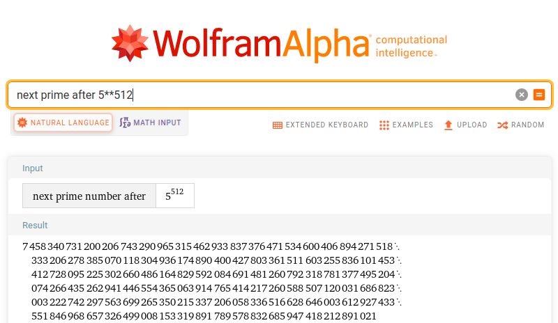

# Week 12

## Task 1: Becoming a Certificate Authority (CA)

- What part of the certificate indicates this is a CA’s certificate?

The Certificate Authority (CA), the one who validates the certificate, can be identified in the issuer of the certificate. 

- What part of the certificate indicates this is a self-signed certificate?

A certificate is self-assigned if both the issuer field and the subject field are the same. This is true for the certificate generated in this task:


- In the RSA algorithm, we have a public exponent e, a private exponent d, a modulus n, and two secret
numbers p and q, such that n = pq.

modulus (n) and public exponent (e):


private exponent (d):


Two secret numbers (p,q -> n=pq)


## Task 2: Generating a Certificate Request for Your Web Server

In this task, we generated a GCR. For that we ran the following command, using our own server name (in this case www.bank32.com)

```shel
openssl req -newkey rsa:2048 -sha256 \
-keyout server.key -out server.csr \
-subj "/CN=www.bank32.com/O=Bank32 Inc./C=US" \
-passout pass:dees
```

This created a two files in our directory -> server.crs and server.key, thus generating a pair of public/private key and the certificate signing request from the public key.

Then, in order to add alternative names for the web server in the certificate we ran the command above again but with the following flag:

```shel
-addext "subjectAltName = DNS:www.bank32.com, \
DNS:www.bank32A.com, \
DNS:www.bank32B.com"
```

This way we could replace the previous certificate with one that allowed multiple alternative names, so this web server can be acceced by any of them and the certificate still applies:

Excerpt from server.csr:


## Task 3: Generating a Certificate for your server

In this task we want the CSR file to be verified by the CA signature we created in the first task. In order to do that we run the following command so that the CSR we created in the previous task, becomes an actual certificate that can be used by the web server we configured (www.bank32.com)

```shel
openssl ca -config myCA_openssl.cnf -policy policy_anything \
    -md sha256 -days 3650 \
    -in server.csr -out server.crt -batch \
    -cert ca.crt -keyfile ca.key

```
After signing the certificate, we also checked if the alternatives name were included in it:


## Task 4: Deploying Certificate in an Apache-Based HTTPS Website

To deploy the https website we first had to modify the bank32_apache_ssl file to include our own informations namely our own document root, the sever name and the alias we created, and both the SSLCertificateFile and the SSLCertificateKeyFile so the file looks like this:

```xml

<VirtualHost *:443> 
    DocumentRoot /var/www/bank32
    ServerName www.bank32.com
    ServerAlias www.bank32A.com
    ServerAlias www.bank32B.com
    DirectoryIndex index.html
    SSLEngine On 
    SSLCertificateFile /certs/server.crt
    SSLCertificateKeyFile /certs/server.key
</VirtualHost>

<VirtualHost *:80> 
    DocumentRoot /var/www/bank32
    ServerName www.bank32.com
    DirectoryIndex index_red.html
</VirtualHost>

```

And we also did other alterations to the DockerFile so the docker could run with our own certificates.

So when we started the docker and accessed to the www.bank32.com we could view the page. (Note we can run it with https only because we gave permission to access to an unsafe browser)


To have be able to navigate safely in the website we had to add our own ca.crt to Firefox certificates. Then we could navigate safely in the browser:


## Task 5: Launching a Man-In-The-Middle Attack

To set up our malicious website first we had to alter the file bank32_apache_ssl to change the Server Name to the website we intend to fake (www.facebook.com)

```xml

<VirtualHost *:443> 
    DocumentRoot /var/www/bank32
    ServerName www.facebook.com
    ServerAlias www.bank32A.com
    ServerAlias www.bank32B.com
    DirectoryIndex index.html
    SSLEngine On 
    SSLCertificateFile /certs/server.crt
    SSLCertificateKeyFile /certs/server.key
</VirtualHost>

<VirtualHost *:80> 
    DocumentRoot /var/www/bank32
    ServerName www.bank32.com
    DirectoryIndex index_red.html
</VirtualHost>

```
Then had to also add a new host for this website:

` 10.9.0.80 www.facebook.com `

Lastly we had to add a new Alias in our certificate so it supports this new website.

However we could not load the page since the certificate was not valid for that url.

## Task 6: Launching a Man-In-The-Middle Attack with a Compromised CA

To be able to load the page, we had to recreate our certificate so that we include this url in our alias. Having done that and after restarting the server, we were able to access to ` www.facebook.com `:


## Week 12 CTF

### First Challenge

For this challenge, we were given an RSA encrypted flag. 
The idea of the challenge was to break the encryption and get the flag.

For the RSA algorithm to work it needs the following values:
 - Two prime numbers `p` and `q`.
 - An exponent `e`.
 - A value `d`, which is the modular inverse of e modulo `(p-1)(q-1)`.

We knew that `p` was a prime number next to `2**512`. 
So, to get `p` we used *Wolfram Alpha*:



In turn, we also knew that `q` was a prime number next to `2**513`.
Following the same method as for `p`, we were able to get the value.

As the exponent `e` was given, all was left to do was to get `d`:
```
d = modular_inverse(e, (p-1)*(q-1))
```

After all this values were obtained, we used the given `template.py` file to decipher the flag.

### Second Challenge

The goal of this challenge was also to break a RSA key.
This time, we were given two messages created with different exponents but the same p.
After a bit of research, we came across [this](https://crypto.stackexchange.com/questions/1614/rsa-cracking-the-same-message-is-sent-to-two-different-people-problem) thread that explained the math needed to solve the problem.

First, we made sure the gcd of both exponents was 1, in order for this to work.
Then, we calculated `a` and `b` such that `e1*a + e2*b = 1`. This was done with the extended euclidean algorithm. 
Because b was negative, we used the modular inverse of the second message for the calculations (let that value be `i`).

With all the above values calculated, we could arrive at the original message with the following: 

```
message = (c**a1 * i**(-b)) mod n
```

That was done with the following python snippet:

```py
n = # ommited

a = 32769
b = -32768

c1 = # first message 
c2 = # second message 

c1=int.from_bytes(unhexlify(c1), "big")
c2=int.from_bytes(unhexlify(c2), "big")

flag = (c1**a * modular_inverse(c2, n)**(-b)) % n
```

