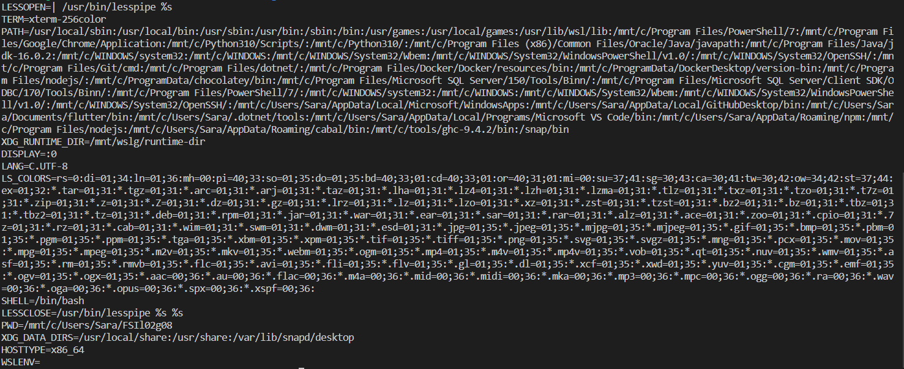
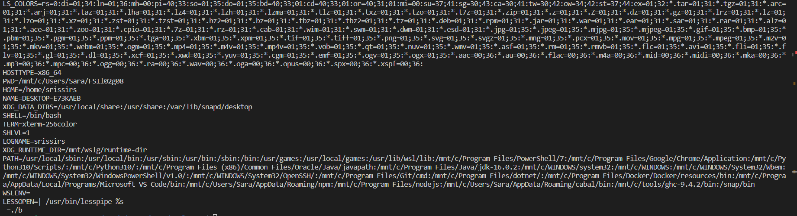

# Trabalho realizado na Semana #4

## Tarefa 2.1

Utilizar o comando `printenv` ou `env` é possível observar o valor das variáveis de ambiente.

```bash
$ printenv USERNAME
seed
```

Para alterar os valores das variáveis, recorremos aos comandos `export` e `unset`.

```bash
$ unset USERNAME
$ printev USERNAME #prints nothing
$ export USERNAME=seed
$ printenv USERNAME
seed
```

## Tarefa 2.2

Compilar o ficheiro `myprintenv.c`, imprimindo as variávies de ambiente para os ficheiros `child.txt` e `parent.txt`.

```bash
$ gcc myprintenv.c
$ ./a.out > child.txt
$ gcc myprintenv.c      #after changes are made
$ ./a.out > parent.txt
$ diff child.txt parent.txt
```

O último comando não imprime nenhum resultado, ou seja, os ficheiros são iguais. Isto acontece porque o processo filho herda todas as variáveis de ambiente do pai quando é criado.

## Tarefa 2.3

Utilizar a função `execve` para criar um processo fornecendo as variáveis de ambiente. O terceiro argumento da função, `envp` é um array que permite passar as variáveis de ambiente para o processo criado.
Quando `envp=NULL`, a execução do programa não imprime qualquer resultado.

```bash
$ gcc myenv.c
$ ./a.out       #prints nothing
```

Ao alterar o argumento `envp` para `environ`, observa-se que o programa imprime uma série de variáveis de ambiente (listadas em `environ`). Podemos então concluir que a função `execve` permite executar processos com variáveis de ambiente arbitrárias.

## Tarefa 2.4

Correr o comando *system("/usr/bin/env")* dá o mesmo resultado que correr *execve("/usr/bin/env", argv, environ)*, como pode ser verificado abaixo:
#


*Output de system("/usr/bin/env")*

Isto acontece porque *system()* chama a função *execl()*, que por sua vez chama *execve()*, passando por defeito um *array* infinito para as variáveis de ambiente.

## Tarefa 2.5


No Passo 3 definimos novas variáveis de ambiente, nomeadamente TEST e LD_LIBRARY_PATH. Contudo, estas novas variáveis não aparecem na listagem quando corremos o programa Set_UID compilado no Passo 2, como podemos ver no *output* abaixo:

#

*Output do programa Set_UID  compilado no Passo 2*

O resultado  é inesperado na medida em que, apesar do processo filho herdar as variáveis de ambiente já existentes no processo pai, este não herda as novas variáveis de ambiente adicionadas anteriormente.

## Tarefa 2.6


<br/>

# CTF Semana 4


## Desafio 1

Tal como indicava o enunciado os primeiros passos consistiram em descobrir algumas informações sobre a plataforma, nomeadamente a versão de *WordPress* do website e alguns dos *plugins* utilizados.

Esta primeira foi descoberta com recurso ao *inspector* pesquisando pela *keyword* "Wordpress" chegando ao valor 5.8.1. De seguida, na *tab* "Additional Information" presente na página de um dos produtos à venda, descobrimos os plugins e as suas versões.

Com esta informação pesquisamos quais os CVEs existentes para aquela versão de Wordpress e associados aos plugins encontrados. Por fim, chegamos ao CVE 2021-34646 que está diretamente relacionado com um dos plugins encontrados (*WooCommerce Booster*).

## Desafio 2 

Depois de confirmar que o CVE escolhido estava correto, procedemos à procura de exploits com o mesmo. Utilizando a plataforma Exploit Database foi possível encontrar um [script](https://www.exploit-db.com/exploits/50299) python que iria permitir explorar a vulnerabilidade.

```bash
$ python3 script.py http://ctf-fsi.fe.up.pt:5001/my-account/ 1
# O argumento 1 foi utilizado porque este é o id geralmente atribuído ao administrador.
```

A execução do programa gerou um link que nos garantiu acesso admin ao site. Entrando na página da adminstração, encontramos a flag numa mensagem intitulada *Message to our employees*.
